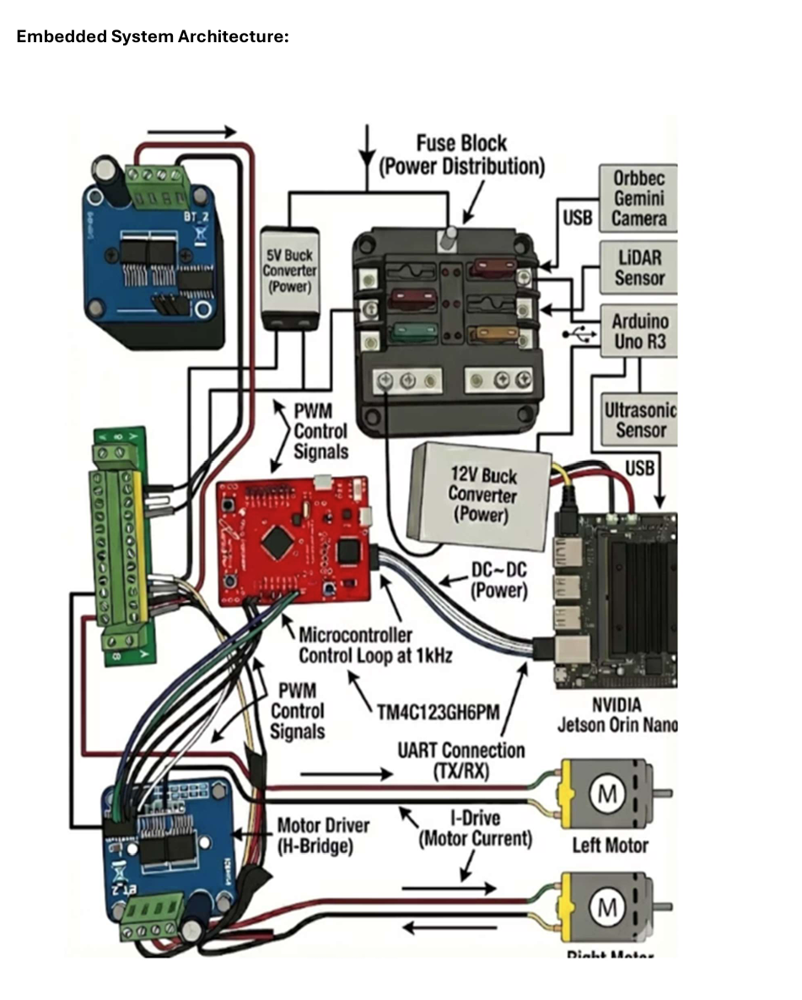

# 🤖 Autonomous Indoor Delivery Robot

> Full-stack autonomous mobile robot built from scratch — custom embedded firmware, LiDAR SLAM navigation, and real-time sensor fusion on a $300 budget.

**[▶️ Watch it navigate a real hallway →](https://youtube.com/shorts/yjfqP266TCM?feature=share)**

---

## What This Is

A fully autonomous differential-drive robot capable of:
- **Mapping and navigating** real indoor environments using LiDAR SLAM
- **Avoiding obstacles** in real time with ultrasonic sensors and LiDAR
- **Closed-loop motor control** at 1kHz using a custom PI controller on bare-metal embedded C
- **Splitting compute** cleanly: real-time firmware on TM4C microcontroller, high-level autonomy on NVIDIA Jetson Orin Nano

Built as a senior capstone project at the University of Toledo. Every subsystem — firmware, power distribution, sensor integration, hardware bring-up — was debugged and validated on real hardware in real hallways.

---

## Demo

| Nominal State | Happy | Alert |
|---|---|---|
|  |  |  |

The LED matrix displays robot emotional state based on navigation status — a design choice to make the robot's intent legible to nearby humans.

**Live navigation demo:** https://youtube.com/shorts/yfjqP266TCM?feature=share

---

## System Architecture



The system separates concerns across two compute layers:

| Layer | Hardware | Responsibility |
|---|---|---|
| Real-Time Control | TM4C123GH6PM @ 80MHz | Motor PI control @ 1kHz, encoder reading, PWM output, UART comms |
| High-Level Autonomy | NVIDIA Jetson Orin Nano | ROS2 Nav2, SLAM Toolbox, AMCL localization, path planning |

Communication between layers: **UART (TX/RX)** — velocity commands down, odometry up.

---

## Hardware Stack

| Component | Purpose |
|---|---|
| NVIDIA Jetson Orin Nano | Edge compute for ROS2 + SLAM |
| TM4C123GH6PM Microcontroller | Real-time embedded control @ 80MHz |
| RPLiDAR S2 | 2D laser ranging for SLAM and obstacle detection |
| MPU6050 IMU | Orientation via I²C |
| HC-SR04 / RCWL-1601 Ultrasonic (×3) | Short-range obstacle detection |
| Orbbec Gemini Depth Camera | Visual perception |
| H-Bridge Motor Drivers | Bidirectional PWM motor drive |
| Quadrature Encoders | Closed-loop velocity feedback |
| 12V + 5V Buck Converters | Regulated power distribution |
| Fused Power Distribution Block | Safe multi-rail power delivery |

**Total BOM cost: ~$300**

---

## Firmware (TM4C — Embedded C)

### Motor Velocity PI Controller (`firmware/motor_pi_control.c`)

The core of the real-time control loop, running at **1kHz via SysTick interrupt**.

**Key design decisions:**
- Separate PI gains tuned independently for left and right motors (`KP_L=0.00085`, `KI_L=0.0045`, `KP_R=0.00025`, `KI_R=0.0080`) — necessary because motor characteristics differed
- Low-pass filter on velocity estimate (`α=0.25`) to suppress encoder noise without adding lag
- Integrator anti-windup clamped at ±1000
- Skip PI entirely when target velocity is near zero → quiet motor coast, no buzz
- Duty cycle clamped 25–90% to protect motors and stay in linear H-bridge region
- 20kHz PWM frequency to stay above audible range

**Control loop per wheel (runs every 1ms):**
```
Read QEI position → compute delta counts → estimate velocity (mm/s)
→ apply LPF → compute PI error → update integrator → clamp → write PWM
```

**Mission state machine:**
```
M_INIT → M_FWD (10m) → M_BACK (10m) → M_WAIT (40s) → repeat
```
Distance tracked via encoder integration, not time — so actual distance is correct regardless of speed variation.

**Serial telemetry at 10Hz:**
```
L t=900 v=897.3 e=2.7 I=45.2 u=0.247 d=0.247 | R t=900 v=901.1 e=-1.1 ...
```

---

### Ultrasonic Sensor Driver (`firmware/ultrasonic.c`)

Polling-based distance measurement for the RCWL-1601 sensor on TM4C GPIO.

- TRIG on PB6, ECHO on PA4
- 10µs trigger pulse, echo pulse width measured in µs via busy-wait loop
- Distance formula: `d_cm = echo_us / 58`
- Timeout handling for out-of-range / no-echo conditions
- UART output at ~10Hz for real-time monitoring

---

## ROS2 Navigation Stack (Jetson)

> *Note: ROS2 node source not included in this repo — navigation stack ran on Jetson Orin Nano.*

Navigation pipeline:
```
LiDAR → SLAM Toolbox (mapping) → AMCL (localization) → Nav2 (path planning) → cmd_vel → UART → TM4C
```

- **SLAM Toolbox** for initial map generation across 3,000 ft² campus area
- **AMCL** for localization within saved map
- **Nav2** for goal-to-goal waypoint navigation with dynamic obstacle avoidance
- **EKF** (`robot_localization` package) fusing wheel odometry + IMU for drift-corrected pose

---

## What I Personally Built

This was a team project. My contributions:

- **All embedded C firmware** — PI motor controller, ultrasonic driver, PWM/QEI peripheral setup, UART communication
- **Power distribution system** — fused distribution block, 12V/5V buck converter wiring, rail isolation
- **Hardware bring-up** — oscilloscope debugging of PWM signals, UART framing, QEI counting direction
- **Motor driver integration** — H-bridge wiring, polarity mapping, deadband tuning
- **UART bridge** between Jetson and TM4C — framing, baud rate matching, timing validation

---

## Engineering Challenges

**Motor asymmetry:** Left and right motors had different characteristics requiring independent PI gains. Diagnosed via serial telemetry — velocity error diverged at the same cmd_vel, confirming hardware mismatch not firmware bug.

**Encoder direction:** QEI0 required `QEI_CONFIG_SWAP` to read forward as positive; QEI1 did not. Found by commanding known motion and checking sign of position delta.

**UART timing between compute layers:** Jetson and TM4C required careful baud rate matching (115200) and message framing to avoid dropped velocity commands during navigation.

**Budget constraint:** Entire hardware BOM under $300. Required creative component selection and building/reusing lab hardware where possible.

---

## Skills Demonstrated

`Embedded C` · `TM4C123 (ARM Cortex-M4)` · `PWM Motor Control` · `Quadrature Encoders` · `PID/PI Control` · `UART Communication` · `ROS2` · `Nav2` · `SLAM` · `AMCL` · `EKF Sensor Fusion` · `LiDAR` · `IMU (I²C)` · `Ultrasonic Sensors` · `Embedded Linux` · `NVIDIA Jetson` · `Oscilloscope Debugging` · `Power Distribution` · `Hardware Bring-up`

---

## Author

**Abina Pokhrel** — Electrical & Computer Engineering, University of Toledo (May 2026)

[LinkedIn](https://www.linkedin.com/in/abinapokhrel) · abina.pokhrel@rockets.utoledo.edu
