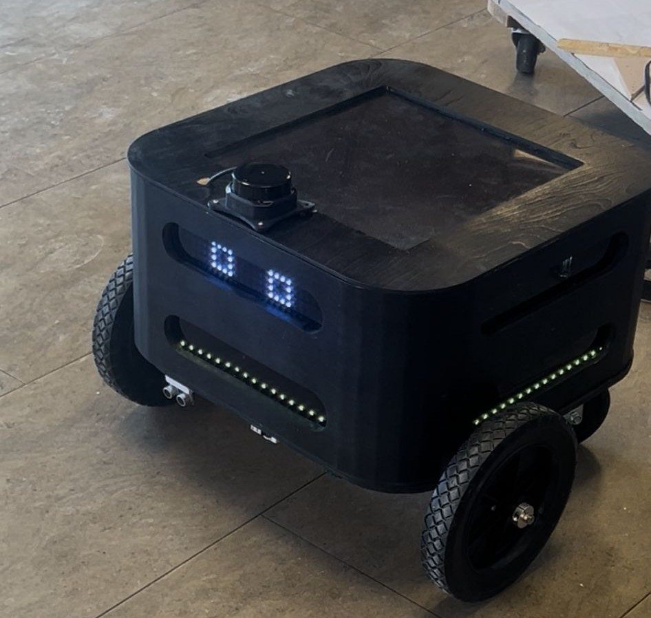
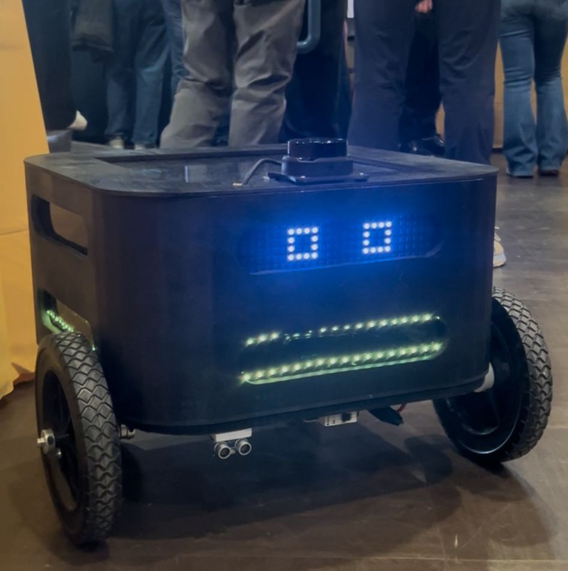
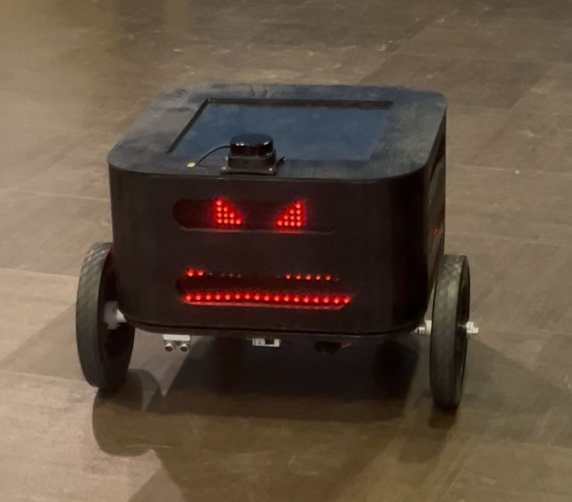

# 🤖 Autonomous Indoor Delivery Robot

> Full-stack autonomous mobile robot built from scratch — custom embedded firmware, LiDAR SLAM navigation, and real-time sensor fusion on a $300 hardware budget (excluding personal development devices).

**[▶️ Watch the robot navigate a real hallway →](https://youtube.com/shorts/yjfqP266TCM?feature=share)**

---

## What This Is

A fully autonomous differential-drive robot capable of:

- **Mapping and navigating** real indoor environments using LiDAR-based SLAM
- **Avoiding obstacles** in real time with ultrasonic sensors and LiDAR point clouds
- **Closed-loop motor control** at 1kHz using a custom PI velocity controller on bare-metal embedded C
- **Splitting compute** cleanly across two layers: real-time firmware on a TM4C microcontroller, high-level autonomy on an NVIDIA Jetson Orin Nano

Built as a senior capstone project at the University of Toledo. Every subsystem — firmware, power distribution, sensor integration, hardware bring-up — was debugged and validated on real hardware in real hallways.

---

## Demo

| Nominal State | Happy | Alert |
|---|---|---|
|  |  |  |

The LED matrix on the front displays the robot's navigation state — a deliberate design choice to make the robot's intent readable to nearby humans during hallway operation.

---

## System Architecture


The system separates real-time hardware control from high-level autonomy across two compute layers:

| Layer | Hardware | Responsibility |
|---|---|---|
| Real-Time Control | TM4C123GH6PM @ 80MHz | Motor PI control @ 1kHz, encoder reading, PWM generation, UART bridge |
| High-Level Autonomy | NVIDIA Jetson Orin Nano (personal device) | ROS2 Nav2, SLAM Toolbox, AMCL localization, EKF sensor fusion, path planning |

**Communication between layers:** UART at 115200 baud — velocity commands (`cmd_vel`) flow down to the TM4C; odometry data flows back up to the Jetson.

> **Note:** The NVIDIA Jetson Orin Nano was a personal development device and is not included in the project BOM cost.

---

## Hardware Stack

| Component | Part | Purpose |
|---|---|---|
| Microcontroller | [TI EK-TM4C123GXL](https://www.ti.com/tool/EK-TM4C123GXL) | Real-time embedded control @ 80MHz (ARM Cortex-M4) |
| Edge Compute | NVIDIA Jetson Orin Nano *(personal device)* | ROS2 + SLAM + Nav2 autonomy stack |
| Drive Motors | [goBILDA 5203 Yellow Jacket Planetary (50.9:1, 117 RPM)](https://www.gobilda.com/5203-series-yellow-jacket-planetary-gear-motor-50-9-1-ratio-24mm-length-8mm-rex-shaft-117-rpm-3-3-5v-encoder/) | Differential drive with built-in quadrature encoders |
| Motor Drivers | [BTS7960 43A H-Bridge](https://www.amazon.com/HiLetgo-BTS7960-Driver-Arduino-Current/dp/B00WSN98DC/) | Bidirectional PWM motor drive, 43A peak current |
| LiDAR | RPLiDAR S2 | 2D laser scan for SLAM mapping and obstacle detection |
| IMU | [MPU-6050 (GY-521)](https://www.amazon.com/HiLetgo-MPU-6050-Accelerometer-Gyroscope-Converter/dp/B01DK83ZYQ) | 6-DOF accelerometer + gyroscope via I²C for EKF odometry fusion |
| Proximity Sensors | HC-SR04 Ultrasonic (×3) | Short-range obstacle detection, safety override layer |
| Battery | [ERYY 12V LiFePO4 25Ah (384Wh)](https://www.amazon.com/ERYY-LiFePO4-Voltmeter-Rechargeable-Phosphate/dp/B0FR41847Y) | Primary power, 5000+ cycle lifespan |
| Power Distribution | [Blue Sea Systems 5025 6-Way Fuse Block](https://www.amazon.com/dp/B000THQ0CQ) | Fused multi-rail power distribution with negative bus |
| Buck Converters | [12V→5V Buck Converter](https://www.amazon.com/dp/B07P663XJV) | Regulated 5V rail for logic and sensors |
| Chassis | Birch plywood (1/2 in.) | Structural frame |
| Drivetrain | goBILDA REX shafts, pillow block bearings, hyper couplers | Precision shaft mounting and power transmission |
| Caster | 5 in. Polyurethane Swivel Caster | Passive rear support |

**Project BOM total: ~$300** *(Jetson Orin Nano excluded — personal development device)*

---

## Firmware (TM4C — Embedded C)

### Motor Velocity PI Controller (`firmware/motor_pi_control.c`)

The core real-time control loop, running at **1kHz via SysTick interrupt** on the TM4C123GH6PM.

**Key design decisions:**

- **Asymmetric PI gains** tuned independently for left and right motors (`KP_L=0.00085`, `KI_L=0.0045`, `KP_R=0.00025`, `KI_R=0.0080`) — necessary because the goBILDA planetary motors had slightly different mechanical characteristics despite being the same model
- **Low-pass filter** on velocity estimate (`α=0.25`) to suppress quadrature encoder noise without adding control lag
- **Integrator anti-windup** clamped at ±1000 to prevent integrator saturation during motor stalls or direction changes
- **Zero-command skip:** PI loop bypassed entirely when target velocity is near zero — motors coast quietly with no PWM buzz
- **Duty cycle clamping** at 25–90% to protect the BTS7960 H-bridges and keep operation in the linear region
- **20kHz PWM frequency** to stay above audible range and reduce motor whine

**Control loop per wheel (executes every 1ms):**
```
Read QEI position → compute delta counts → estimate velocity (mm/s)
→ apply LPF → compute PI error → update integrator → clamp → write PWM to H-bridge
```

**Mission state machine (standalone test mode):**
```
M_INIT → M_FWD (10m) → M_BACK (10m) → M_WAIT (40s) → repeat
```
Distance is tracked via encoder integration — not time — so travelled distance is accurate regardless of load or speed variation.

**Serial telemetry output at 10Hz (monitored via TeraTerm):**
```
L t=900 v=897.3 e=2.7 I=45.2 u=0.247 d=0.247 | R t=900 v=901.1 e=-1.1 ...
```

---

### Ultrasonic Sensor Driver (`firmware/ultrasonic_tm4c.c`)

Polling-based distance measurement for the HC-SR04 ultrasonic sensor, implemented directly on TM4C GPIO without external libraries.

- TRIG output on **PB6**, ECHO input on **PA4**
- 10µs trigger pulse generated via GPIO bit-bang
- Echo pulse width measured in µs via busy-wait loop with 30ms timeout
- Distance: `d_cm = echo_us / 58` (speed of sound at ~343 m/s)
- Timeout handling for out-of-range and no-echo conditions
- Distance output over UART at ~10Hz for real-time monitoring and debugging

---

## ROS2 Navigation Stack (Jetson Orin Nano)

> *ROS2 node source not included in this repo — the autonomy stack was developed and ran on the NVIDIA Jetson Orin Nano.*

The high-level navigation pipeline running on the Jetson under ROS2 Humble:

```
RPLiDAR S2 → SLAM Toolbox (mapping) → AMCL (localization)
                                           ↓
                              Nav2 Stack (path planning + obstacle avoidance)
                                           ↓
                                       cmd_vel
                                           ↓
                              UART → TM4C PI Controller → Motors
```

- **SLAM Toolbox** — used for initial map generation across a 3,000 ft² campus environment including hallways and open areas
- **AMCL (Adaptive Monte Carlo Localization)** — particle filter-based localization within a saved map; robot estimates its pose from LiDAR scan matching against the known map
- **Nav2** — full navigation stack handling goal-to-goal waypoint navigation, dynamic obstacle avoidance, and recovery behaviors
- **EKF (`robot_localization` package)** — fuses wheel odometry from encoder counts with IMU orientation data from the MPU-6050 for drift-corrected pose estimation; critical for reliable handoff between straight-line and turning segments

---

## What I Personally Built

This was a 3-person team project. My contributions covered the embedded and electrical systems side:

- **All embedded C firmware** — PI motor controller, ultrasonic sensor driver, PWM/QEI peripheral initialization, SysTick interrupt handler, UART communication bridge
- **Power distribution system** — Blue Sea fuse block wiring, 12V and 5V buck converter rail design, rail isolation between motor power and logic power
- **Hardware bring-up** — oscilloscope validation of PWM signals, UART framing verification, QEI counting direction debugging
- **Motor driver integration** — BTS7960 H-bridge wiring, forward/reverse polarity mapping, deadband tuning to overcome static friction
- **UART bridge** between Jetson and TM4C — baud rate matching at 115200, message framing to avoid dropped `cmd_vel` packets during navigation

---

## Engineering Challenges

**Motor asymmetry:** The two goBILDA Yellow Jacket motors had subtly different friction and back-EMF characteristics. Diagnosed via serial telemetry — at identical `cmd_vel` targets, velocity error diverged between wheels, confirming hardware mismatch rather than a firmware bug. Solved with independent PI gain tuning per motor.

**Encoder direction:** QEI0 (left motor) required `QEI_CONFIG_SWAP` to read forward motion as positive; QEI1 (right motor) did not. Diagnosed by commanding known forward motion and monitoring the sign of position delta over UART.

**UART timing between compute layers:** Jetson and TM4C required careful baud rate matching (115200) and consistent message framing. Early testing showed dropped velocity commands during high-frequency Nav2 output — resolved by adding message delimiters and tightening the receive buffer on the TM4C side.

**Budget constraint:** Core hardware BOM under $300 (excluding personal Jetson device). Required careful component selection — goBILDA drivetrain hardware for precision, off-the-shelf BTS7960 drivers for current capacity, LiFePO4 battery for cycle life and safety.

---

## Skills Demonstrated

`Embedded C` · `TM4C123 (ARM Cortex-M4)` · `PWM Motor Control` · `Quadrature Encoders` · `PI Velocity Control` · `UART Communication` · `ROS2 Humble` · `Nav2` · `SLAM Toolbox` · `AMCL` · `EKF Sensor Fusion` · `LiDAR` · `IMU (I²C / MPU-6050)` · `Ultrasonic Sensors` · `Embedded Linux` · `NVIDIA Jetson Orin Nano` · `Oscilloscope Debugging` · `Power Distribution Design` · `Hardware Bring-up` · `goBILDA Drivetrain`

---

## Author

**Abina Pokhrel** — Electrical & Computer Engineering, University of Toledo (May 2026)

[LinkedIn](https://www.linkedin.com/in/abinapokhrel) · abina.pokhrel@rockets.utoledo.edu
